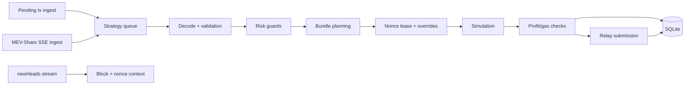

<div align="center">

# Oxidity Searcher

<p>
  <strong>Mainnet-first MEV searcher for Ethereum</strong><br/>
  Low-latency ingest, deterministic simulation, strict risk controls, and relay-aware execution.
</p>

<p>
  
  
  
</p>

<p>
  
  
  
</p>

<p>
  <a href="#quick-start">Quick Start</a> |
  <a href="#architecture">Architecture</a> |
  <a href="#mainnet-and-nethermind-requirements">Mainnet + Nethermind</a> |
  <a href="#configuration">Configuration</a> |
  <a href="#deployment-checklist">Deployment Checklist</a>
</p>

</div>

<p align="center"><sub>-------------------------------- OXIDITY SEARCHER --------------------------------</sub></p>

## Brand Profile

- Product: `Oxidity Searcher`
- Mission: detect and execute profitable MEV opportunities with strict safety boundaries
- Scope: single-operator runtime, Ethereum mainnet primary, EVM-compatible extension path
- Stack: Rust + Tokio + Alloy + SQLite

<p align="center"><sub>-------------------------------- OXIDITY SEARCHER --------------------------------</sub></p>

## At A Glance

| Area | Current behavior |
| --- | --- |
| Ingest | Pending tx stream + MEV-Share SSE with dedupe and backpressure |
| Simulation order | `eth_simulateV1 -> debug_traceCallMany -> eth_call` |
| Strict mainnet gate | requires `eth_simulateV1` or `debug_traceCallMany` |
| Risk accounting | signed net PnL (`gross - gas - bribe - flashloan_premium`) |
| Nonce safety | persisted lease model via `nonce_state` |
| Submission | Flashbots-style multi-relay `eth_sendBundle`, `mev_sendBundle` support |
| CI bar | format check, strict clippy, compile, tests |

<p align="center"><sub>-------------------------------- OXIDITY SEARCHER --------------------------------</sub></p>

## Quick Start

```bash
METRICS_TOKEN=<token> cargo run --release
```

Health and metrics:
- `GET /health`
- `GET /` (bearer token required)

<p align="center"><sub>-------------------------------- OXIDITY SEARCHER --------------------------------</sub></p>

## Architecture

### Layer map

| Layer | Responsibility |
| --- | --- |
| App | config loading, logging bootstrap, CLI overrides |
| Common/Domain | constants, errors, retry helpers |
| Infrastructure | providers, gas oracle, price feed, ingest, reserve cache, DB |
| Services/Strategy | decode, risk, planning, simulation, execution, metrics, portfolio |

### Runtime composition per chain

| Component | Notes |
| --- | --- |
| Providers | IPC is used only when explicitly configured; otherwise WS + HTTP |
| Queue | bounded ingest queue (`2048`) with drop/backpressure accounting |
| Workers | semaphore controlled by `STRATEGY_WORKERS` |
| Persistence | SQLite migrations + restart-safe nonce state |



<p align="center"><sub>-------------------------------- OXIDITY SEARCHER --------------------------------</sub></p>

## Mainnet And Nethermind Requirements

### Strict capability checks

| RPC capability | Requirement |
| --- | --- |
| `eth_feeHistory` | required |
| `eth_simulateV1` | required unless `debug_traceCallMany` is available |
| `debug_traceCallMany` | required unless `eth_simulateV1` is available |
| `debug_traceCall` | supplementary single-tx diagnostic path |

### Nethermind operating profile

- Enable modules: `Eth`, `Subscribe`, `TxPool`, `Trace`, `Debug`, `Net`, `Web3`, `Rpc`, `Admin`
- Enable traces: `TraceStore.Enabled = true`
- Prefer local IPC/WS endpoints for latency-sensitive paths
- Tune burst behavior: `JsonRpc.EthModuleConcurrentInstances`, `JsonRpc.RequestQueueLimit`, `JsonRpc.Timeout`

<p align="center"><sub>-------------------------------- OXIDITY SEARCHER --------------------------------</sub></p>

## Safety And Risk Controls

| Control | Purpose |
| --- | --- |
| Circuit breaker | halts after failure streak, auto-resets on window |
| Signed PnL | preserves losses for correct risk gating |
| Nonce leasing | prevents nonce reuse and restart races |
| Pool conflict checks | blocks conflicting merged bundles |
| Toxic token probes | avoids unreliable sell paths |
| Receipt tri-state | handles unknown relay outcomes safely |
| Gas cap floors | prevents uncapped bidding behavior |

<p align="center"><sub>-------------------------------- OXIDITY SEARCHER --------------------------------</sub></p>

## Simulation And Execution

### Core rules

- UniV2 quote: `amountOut = amountIn*997*Rout / (Rin*1000 + amountIn*997)`
- Effective gas fee modeling follows EIP-1559 paid cost semantics
- Profit floor includes full execution cost components
- Flash-loan path supports callback-driven execution with approval hygiene

### Relay behavior

| Path | Behavior |
| --- | --- |
| Mainnet | sends to configured relays/builders, per-relay statuses tracked |
| Replacement | `replacementUuid` supported by default in mainnet mode |
| Cancellation | optional `eth_cancelBundle` before replacement |
| MEV-Share | enforces one victim hash + one backrun tx shape |
| Non-mainnet | falls back to `eth_sendRawTransaction` |

<p align="center"><sub>-------------------------------- OXIDITY SEARCHER --------------------------------</sub></p>

## Persistence And Accounting

### Core tables

| Table | Purpose |
| --- | --- |
| `transactions` | transaction lifecycle records |
| `profit_records` | gross/net plus cost components |
| `market_prices` | sampled price context |
| `nonce_state` | restart-safe nonce baseline and touched pools |
| `router_discovery` | discovered/approved router metadata |

### Net PnL equation

`net = gross - gas - bribe - flashloan_premium`

This equation is consistent across strategy logic, DB writes, and portfolio tracking.

<p align="center"><sub>-------------------------------- OXIDITY SEARCHER --------------------------------</sub></p>

## Configuration

### Core config domains

- wallet and bundle signer keys
- chain router/feed maps
- RPC/WS/IPC URLs
- slippage and gas guard controls
- flash-loan and sandwich toggles
- MEV-Share relays/builders and history settings
- metrics bind and token

### Important runtime safety fields

| Field | Default |
| --- | --- |
| `receipt_poll_ms` | `500` |
| `receipt_timeout_ms` | `12000` |
| `receipt_confirm_blocks` | `4` |
| `emergency_exit_on_unknown_receipt` | `false` |
| `rpc_capability_strict` | enabled on chain `1` |
| `chainlink_feed_conflict_strict` | enabled on chain `1` |
| `bundle_use_replacement_uuid` | enabled on chain `1` |
| `bundle_cancel_previous` | `false` |

### Environment overrides

- `ETHERSCAN_API_KEY`
- `RPC_URL_n`, `WS_URL_n`
- `IPC_URL_n`, `IPC_PATH_n`
- `CHAINLINK_FEEDS_PATH`, `TOKENLIST_PATH`
- `STRATEGY_WORKERS`
- `METRICS_*`

<p align="center"><sub>-------------------------------- OXIDITY SEARCHER --------------------------------</sub></p>

## Testing And CI

### CI gates

- `cargo fmt --all -- --check`
- `cargo clippy --workspace --all-targets --all-features --locked -- -D warnings`
- `cargo check --workspace --all-targets --locked`
- `cargo test --workspace --locked`

### Test coverage highlights

- config and strict-gating behavior
- decode and routing correctness
- nonce lease behavior
- signed PnL and risk guard expectations
- simulation backend and error handling
- MEV-Share path integrity

<p align="center"><sub>-------------------------------- OXIDITY SEARCHER --------------------------------</sub></p>

## Deployment Checklist

- [ ] Set `WALLET_KEY`, `BUNDLE_SIGNER_KEY`, `METRICS_TOKEN`, and RPC URLs via environment.
- [ ] Confirm node supports strict simulation gate (`eth_simulateV1` or `debug_traceCallMany`).
- [ ] Verify router/feed configuration for each chain.
- [ ] Validate executor/profit receiver settings.
- [ ] Fund wallet or enable flash-loan path with deployed executor.
- [ ] Restrict metrics endpoint exposure (loopback/TLS/ACL).

<p align="center"><sub>-------------------------------- OXIDITY SEARCHER --------------------------------</sub></p>

## Windows Installer (Preview)

- Build: `./scripts/build-installer.ps1`
- Installer definition: `installer/oxidity_installer.iss`
- Setup writes `{app}\\config.prod.toml`

<p align="center"><sub>-------------------------------- OXIDITY SEARCHER --------------------------------</sub></p>

Updated: **February 13, 2026**
